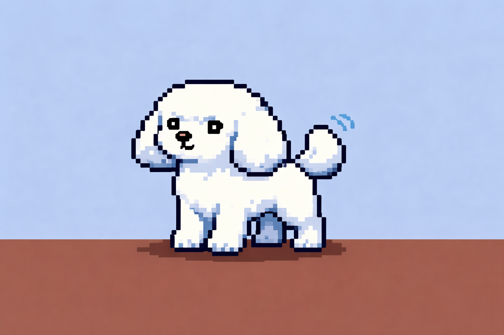

## 🐩 Mood Poodle 🐩

### 🙂 **CONTENT** 🙂
**Mood Score:** 50/100

*Waiting for first contribution*

---

� **Interaction Stats**
| Type | Count |
|------|-------|
| Pets received | 0 |
| Treats received | 0 |

**Recent visitors:** No one yet!

---

### Want to make the poodle happier?

Comment on the [🐩 Poodle Interaction issue](../../issues?q=is%3Aissue+is%3Aopen+Poodle+in%3Atitle) with:
- `!pet` - Give the poodle some pets 🐾
- `!feed` - Give the poodle a treat 🍖

---

📊 **Contribution Stats**
| Metric | Value |
|--------|-------|
| Last Contribution | Never |
| Contributions (7 days) | 0 |
| Contributions (30 days) | 0 |
| Repositories | 0 |

<!--END_SECTION:poodle-->

---

## 🤖 About This Project

This repository was created with the assistance of AI models to demonstrate automated GitHub profile interactions with a virtual poodle.

### AI Models Used
- **GitHub Copilot** - Using GPT-5, Claude Opus 4.6 and Claude Sonnet 4.5 

Key prompts can be found in the prompts folder
